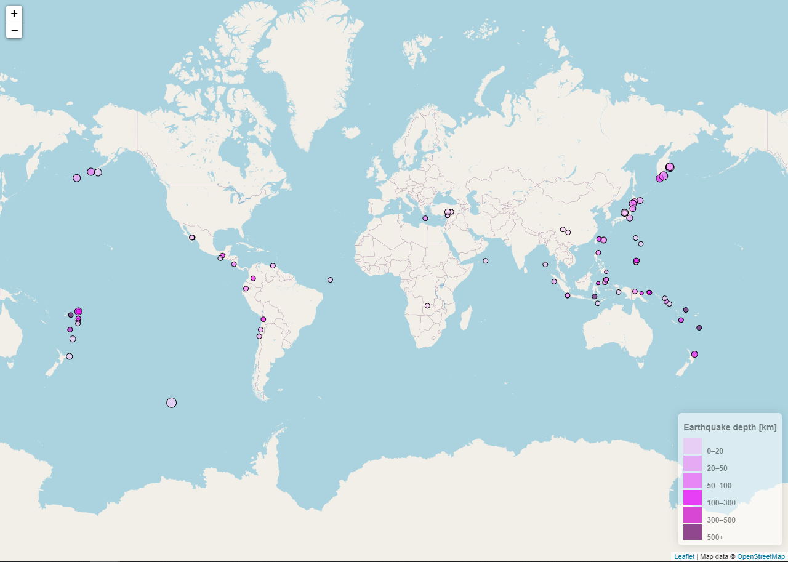
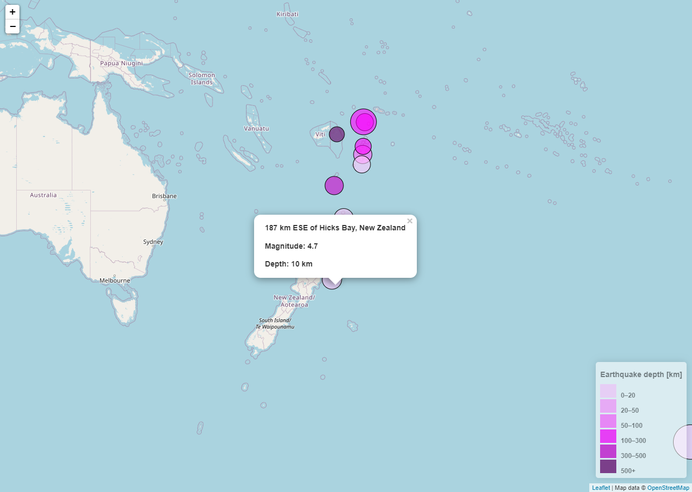

# Visualizing Earthquakes 

  
  

### Description

This tool visualizes earthquake depth and magnitude on a world map using the GeoJSON from The United States Geological Survey (USGS). 
A marked world map is created using earthquake data above Richter magnitude 4.5 from the past 7 days <a href="https://earthquake.usgs.gov/earthquakes/feed/v1.0/summary/4.5_week.geojson"><b>[1]</b></a>. 
Colour and size of the markers are used to distinguish earthquake depth and size, respectively, with interactive tooltips displaying the information. 
This tool is intended to be straightforward to use; only a web browser is required.

### Libraries Used

* Leaflet 1.6.0 
* D3.js

### Executing the Program

* Download the 'Code' folder
* Open the 'index.html' in your local web browser 

